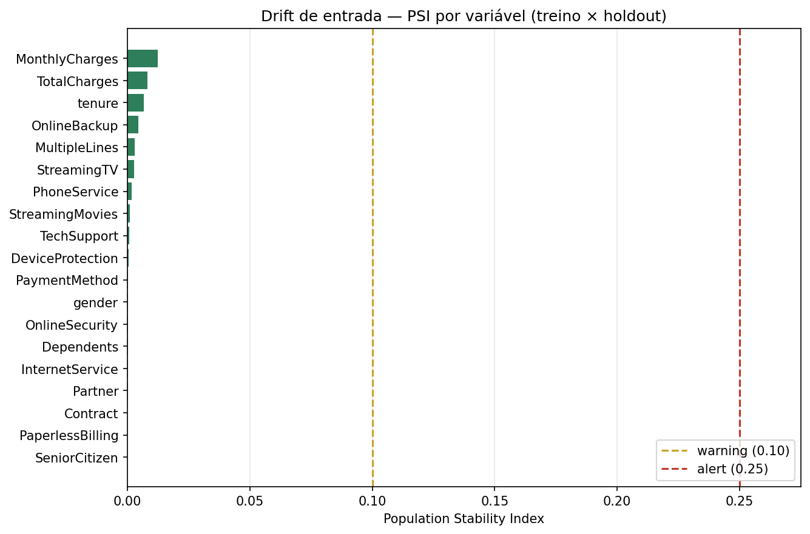

# Churn Prediction — Tech Challenge FIAP Fase 1

Projeto de Machine Learning para previsão de churn, desenvolvido para a Fase 1 do Tech Challenge FIAP. A solução combina análise de dados, comparação de modelos, validação cruzada, otimização de threshold, API REST e interface web para apoiar decisões de retenção.

## Demo

**Aplicação Streamlit:** https://tech-challenge-churn-5qyxdnkzfe9gnagbxcnpks.streamlit.app/

A demo permite informar o perfil de um cliente e consultar a probabilidade estimada de churn, a classificação e o nível de risco. O app publicado roda em modo standalone no Streamlit Cloud; no ambiente local, o projeto também suporta a arquitetura Streamlit → FastAPI.

## Objetivo

Identificar clientes com maior probabilidade de cancelamento e transformar a previsão em uma regra de priorização para ações de retenção.

## Instalação e execução

Requisitos: Python 3.11.

```bash
# 1. ambiente
python -m venv .venv && source .venv/bin/activate

# 2. dependências (inclui ferramentas de desenvolvimento)
pip install -e ".[dev]"

# 3. dataset (baixa a cópia pública; não é versionado no repositório)
python -m src.data.download

# 4. verificações
make lint      # ruff
make test      # pytest

# 5. pipeline de modelagem
python -m src.models.cross_validation    # validação cruzada 5-fold
python -m src.models.compare             # comparação no holdout
python -m src.models.threshold_analysis  # trade-off do threshold
python -m src.models.train               # treina e salva models/churn_pipeline.joblib
python -m src.monitoring.drift           # baseline de drift (PSI)

# 6. aplicações
make run                 # API em http://localhost:8000 (docs em /docs)
streamlit run app.py     # interface + página de Monitoramento
```

Todos os comandos de validação e modelagem acima fazem parte do fluxo automatizado do CI.

## Solução

```text
Dados
  ↓
EDA + validação
  ↓
Preprocessing reproduzível
  ↓
Logistic Regression | Random Forest | MLPClassifier
  ↓
Holdout + validação cruzada 5-fold
  ↓
Threshold analysis
  ↓
Modelo final
  ↓
FastAPI ─────────── Streamlit
```

## EDA e evidências visuais

A EDA completa está no [notebook executado](notebooks/01_eda_baseline.ipynb). Os principais achados e decisões estão documentados em [EDA Findings](docs/EDA_FINDINGS.md).

### Distribuição do churn


### Churn por contrato, internet, pagamento e faturamento


### Churn por faixa de tenure


### Variáveis numéricas por churn


## Modelos avaliados

- Regressão Logística
- Random Forest
- MLPClassifier (Scikit-Learn)

A comparação utiliza o mesmo pipeline de pré-processamento e os mesmos protocolos para os três candidatos.

#### Validação cruzada 5-fold

| Modelo | ROC-AUC (média ± dp) | F1 | Precision | Recall |
|---|---:|---:|---:|---:|
| **Logistic Regression** | **0,8449 ± 0,0135** | **0,6258** | 0,5134 | **0,8015** |
| MLPClassifier | 0,8390 ± 0,0145 | 0,5462 | **0,6718** | 0,4676 |
| Random Forest | 0,8227 ± 0,0106 | 0,6040 | 0,5658 | 0,6479 |

#### Holdout 20%

| Modelo | ROC-AUC | F1 | Precision | Recall | Accuracy |
|---|---:|---:|---:|---:|---:|
| **Logistic Regression** | **0,8413** | **0,6136** | 0,5043 | **0,7834** | 0,7381 |
| MLPClassifier | 0,8391 | 0,5514 | **0,6604** | 0,4733 | **0,7956** |
| Random Forest | 0,8193 | 0,5845 | 0,5423 | 0,6337 | 0,7608 |

A Regressão Logística foi selecionada como modelo final por apresentar o melhor ROC-AUC, F1 e recall nos dois protocolos. Para retenção, o recall é especialmente relevante porque representa a parcela de clientes que realmente cancelaram e foram sinalizados pelo modelo.

## Threshold

No holdout, a análise mostrou que o threshold **0,55** produz o melhor F1 entre os pontos avaliados:

- F1: **0,6176**
- Recall: **75,1%**
- Precision: **52,4%**
- Taxa de intervenção: **38,0%**
- Clientes acionados: **536 de 1.409**

O threshold representa uma política operacional de priorização e pode ser recalibrado conforme a capacidade da equipe e os custos reais de retenção.


## Monitoramento

O drift de entrada é medido por Population Stability Index (PSI) em `src/monitoring/drift.py`, executado pelo CI a cada push e versionado em `reports/drift_baseline.csv`. As faixas adotadas são: estável abaixo de 0,10; atenção entre 0,10 e 0,25; alerta a partir de 0,25.



No baseline atual (treino × holdout) as 19 variáveis estão estáveis, com PSI máximo de 0,0125 em `MonthlyCharges`. A aplicação Streamlit tem uma página **Monitoramento** que lê esse mesmo relatório, e o plano completo de resposta a drift está em [docs/MONITORING.md](docs/MONITORING.md).

Os resultados completos estão versionados em [`reports/`](reports/).

## Aplicação

### Streamlit

Interface para simular um cliente e consultar probabilidade de churn, classificação, nível de risco e threshold utilizado.

Execute localmente:

```bash
streamlit run app.py
```

O app também possui uma página **Monitoramento**, acessível pelo menu lateral, que visualiza o relatório de drift versionado.

### API

A API FastAPI disponibiliza:

- `GET /health` — health check;
- `POST /predict` — previsão de churn.

Execute:

```bash
uvicorn src.api.main:app --reload
```

A documentação interativa fica disponível em `/docs`.

Exemplo de chamada:

```bash
curl -X POST http://localhost:8000/predict \
  -H "Content-Type: application/json" \
  -d '{
    "gender": "Female", "SeniorCitizen": 0, "Partner": "No", "Dependents": "No",
    "tenure": 2, "PhoneService": "Yes", "MultipleLines": "No",
    "InternetService": "Fiber optic", "OnlineSecurity": "No", "OnlineBackup": "No",
    "DeviceProtection": "No", "TechSupport": "No", "StreamingTV": "No",
    "StreamingMovies": "No", "Contract": "Month-to-month", "PaperlessBilling": "Yes",
    "PaymentMethod": "Electronic check", "MonthlyCharges": 79.85, "TotalCharges": 159.7
  }'
```

Resposta:

```json
{
  "churn_probability": 0.8636,
  "churn_prediction": 1,
  "risk_level": "high",
  "threshold": 0.55
}
```

Enquanto `models/churn_pipeline.joblib` não existir, `/predict` responde `503`; execute `python -m src.models.train` antes.

### Docker

Para executar a aplicação completa com Streamlit + FastAPI:

```bash
docker compose up --build
```

A interface ficará disponível em `http://localhost:8501`.

## Estrutura

```text
├── data/
│   ├── raw/
│   └── processed/
├── notebooks/
│   └── 01_eda_baseline.ipynb
├── src/
│   ├── api/
│   ├── data/
│   ├── features/
│   ├── models/
│   ├── monitoring/
│   ├── viz/
│   └── utils/
├── models/
├── reports/
│   ├── cross_validation.csv
│   ├── model_results.csv
│   ├── threshold_analysis.csv
│   └── drift_baseline.csv
├── tests/
├── docs/
│   ├── ARCHITECTURE.md
│   ├── BUSINESS_METRIC.md
│   ├── EDA_FINDINGS.md
│   ├── EXPERIMENTS.md
│   ├── ML_CANVAS.md
│   ├── MODEL_CARD.md
│   ├── MONITORING.md
│   ├── README.md
│   ├── churn_by_contract.png
│   ├── churn_by_tenure.png
│   ├── churn_distribution.png
│   ├── drift_psi.png
│   ├── numeric_by_churn.png
│   └── threshold_curve.png
├── pages/
│   └── 1_Monitoramento.py
├── app.py
├── Dockerfile
├── docker-compose.yml
├── Makefile
└── pyproject.toml
```

## Qualidade e reprodutibilidade

O projeto possui CI no GitHub Actions executando lint, testes automatizados, validação cruzada, comparação de modelos, análise de threshold, monitoramento de drift, treino do artefato final e verificação de consistência dos reports versionados.

### Ambiente de referência

Os resultados versionados são definidos pelo mesmo ambiente do CI:

- Python 3.11
- scikit-learn 1.9.0
- numpy 2.4.6
- scipy 1.17.1
- pandas 2.3.3
- seed 42

As versões das bibliotecas que influenciam os experimentos estão fixadas no `pyproject.toml`. Isso é importante porque pequenas diferenças de implementação podem alterar resultados do Random Forest mesmo quando o restante do pipeline permanece idêntico.

O CI também regenera os relatórios e falha quando os arquivos em `reports/` divergem do resultado gerado pelos scripts.

## Documentação

- [ML Canvas](docs/ML_CANVAS.md) — proposta de valor, decisão suportada, stakeholders, métricas e riscos
- [Notebook de EDA + baseline](notebooks/01_eda_baseline.ipynb) — notebook executado e versionado com outputs.
- [Model Card](docs/MODEL_CARD.md) — uso pretendido, métricas, threshold, limitações, vieses e cenários de falha
- [Métrica de negócio](docs/BUSINESS_METRIC.md) — recall, taxa de intervenção e trade-off do threshold
- [EDA Findings](docs/EDA_FINDINGS.md) — qualidade dos dados, evidências visuais e decisões de modelagem
- [Experimentos](docs/EXPERIMENTS.md) — protocolo de avaliação e seleção do modelo
- [Arquitetura](docs/ARCHITECTURE.md) — componentes e modos de execução
- [Plano de monitoramento](docs/MONITORING.md) — drift, performance e gatilhos de revalidação

## Limitações

O dataset é histórico e representa uma população específica de telecomunicações. O modelo não observa diretamente fatores externos de churn e não estabelece causalidade. O desempenho deve ser reavaliado quando novos dados rotulados estiverem disponíveis.
