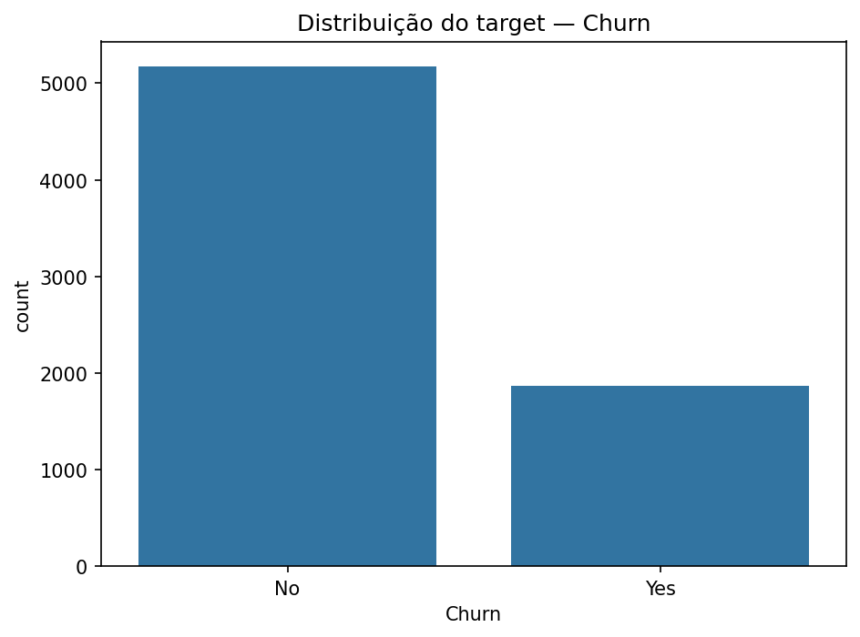
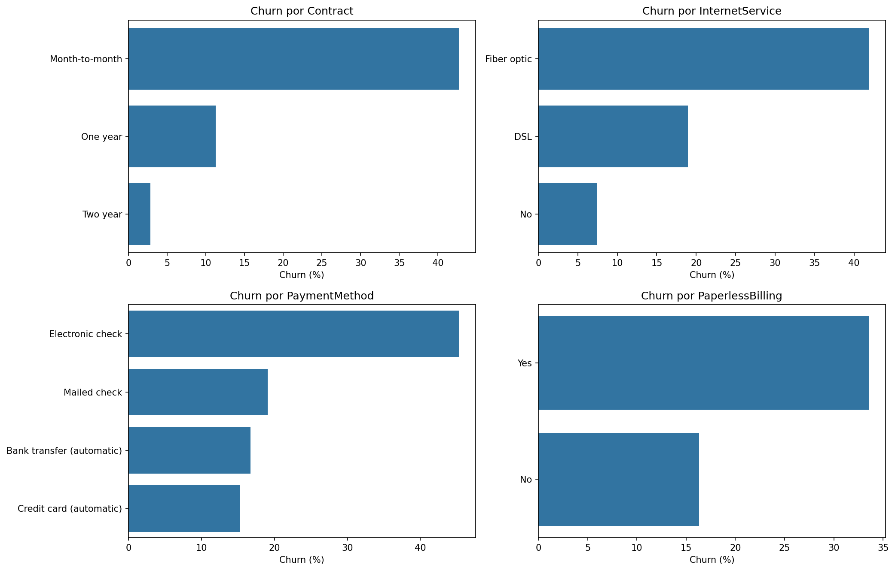
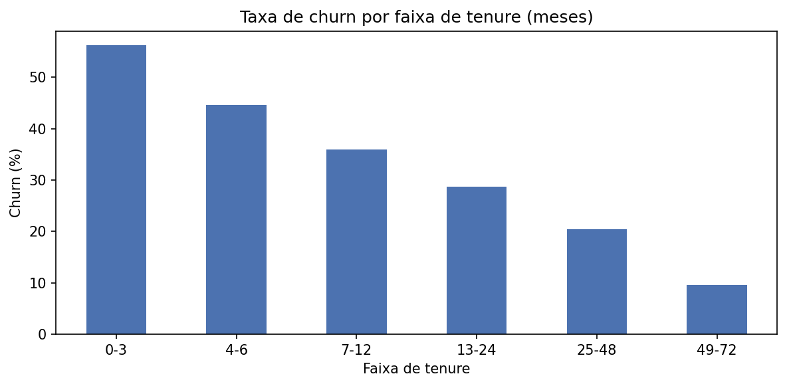
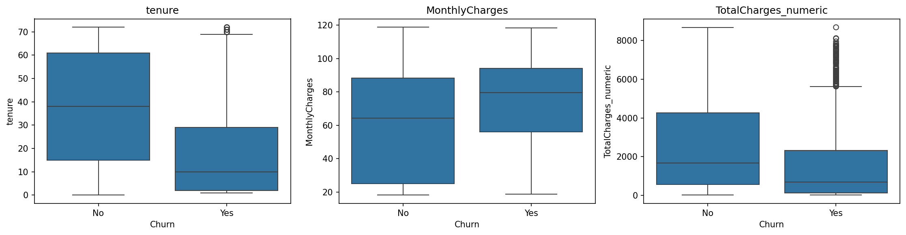
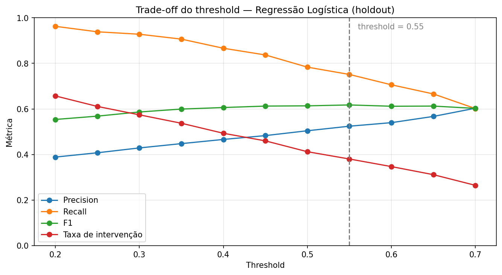

# Documentação

Este diretório reúne a documentação técnica, metodológica e operacional da solução, além das evidências visuais da EDA.

## Modelo e dados

- [Model Card](MODEL_CARD.md) — objetivo, uso pretendido, dados, métricas, threshold, limitações, vieses e cenários de falha.
- [EDA Findings](EDA_FINDINGS.md) — qualidade dos dados, tratamento de `TotalCharges`, hipóteses, decisões de modelagem e evidências visuais.
- [Notebook de EDA + baseline](../notebooks/01_eda_baseline.ipynb) — notebook executado e versionado com outputs.
- [Experimentos](EXPERIMENTS.md) — protocolos de holdout e 5-fold CV, comparação dos candidatos, escolha do modelo e análise de threshold.

## Evidências visuais

### Distribuição do churn

### Churn por contrato, internet, pagamento e faturamento

### Churn por faixa de tenure

### Variáveis numéricas por churn

### Trade-off do threshold

## Negócio e operação

- [Métrica de negócio](BUSINESS_METRIC.md) — taxa de intervenção, recall e trade-off do threshold para priorização de retenção.
- [Plano de monitoramento](MONITORING.md) — drift, distribuição das previsões, performance retrospectiva, gatilhos de revalidação e playbook.

## Engenharia

- [Arquitetura](ARCHITECTURE.md) — camadas da aplicação, API, Streamlit, Docker, deploy e decisões técnicas.
- [Visualização do threshold](../src/viz/threshold_curve.py) — gera a curva diretamente de `reports/threshold_analysis.csv`.
- [Monitoramento de drift](../src/monitoring/drift.py) — calcula PSI e gera o baseline versionado.

## Resultados reproduzíveis

Os resultados dos experimentos ficam versionados em `../reports/`:

- `model_results.csv` — comparação dos candidatos no holdout;
- `cross_validation.csv` — métricas médias e desvios dos 5 folds;
- `threshold_analysis.csv` — avaliação dos pontos de corte de 0,20 a 0,70;
- `drift_baseline.csv` — baseline de PSI entre treino e holdout.

Os arquivos são produzidos pelos scripts em `src/models/` e `src/monitoring/` e validados pelo GitHub Actions. O ambiente oficial é definido no `pyproject.toml` para reduzir diferenças entre execuções.
